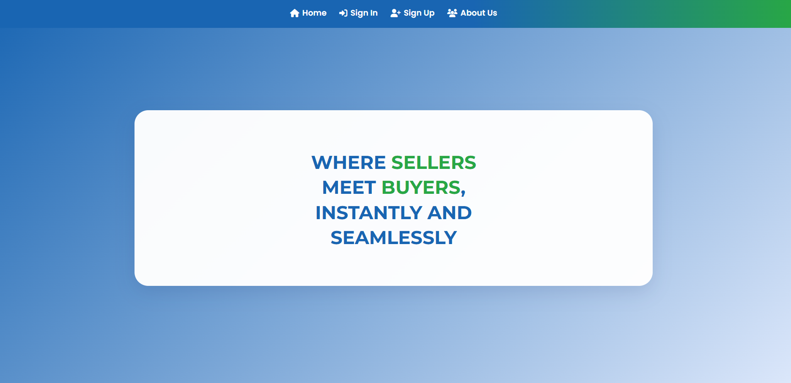
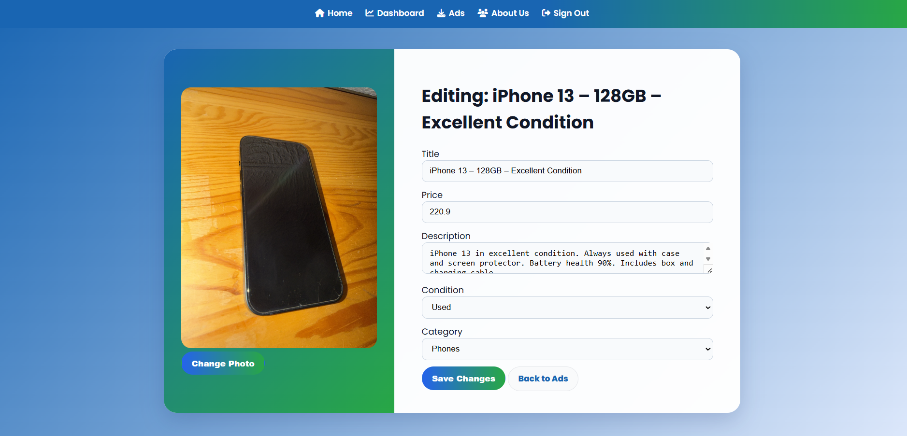
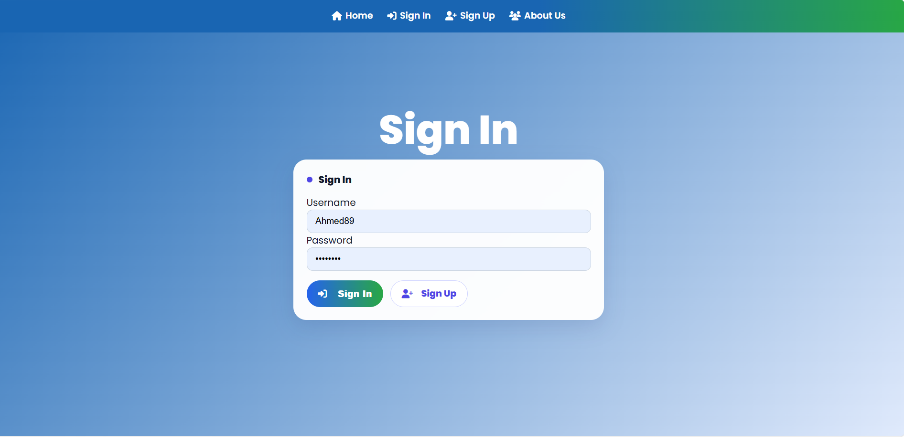
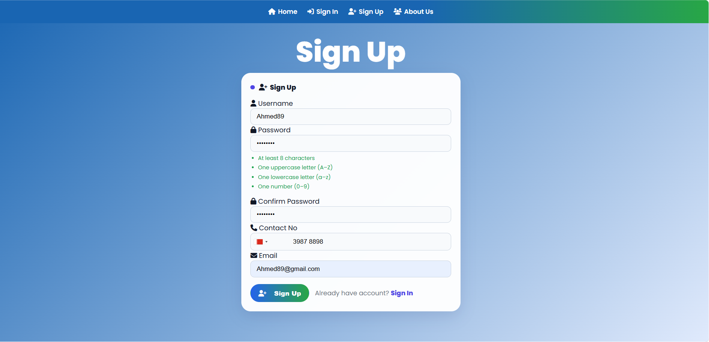
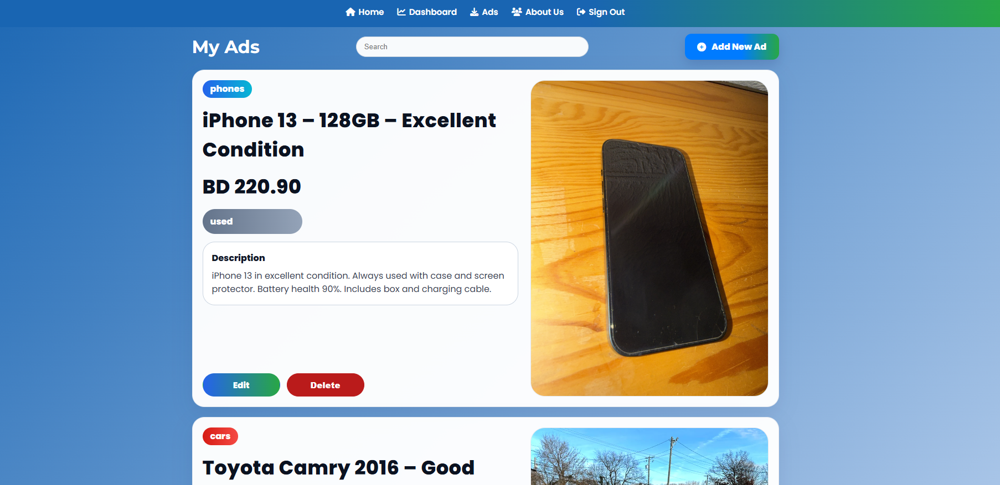
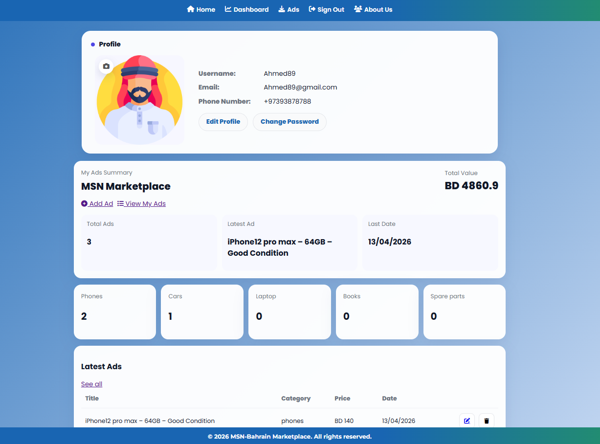
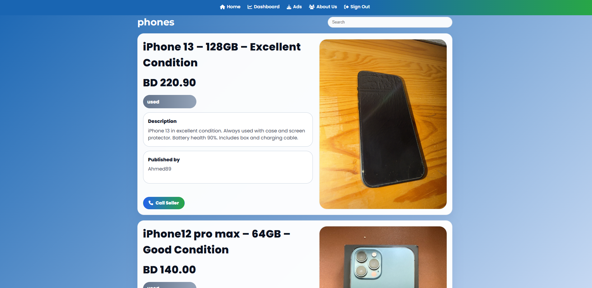

# 🛒 MSN Bahrain 🇧🇭  
### A Modern Classified Ads Marketplace

---

## 📸 UI Preview

### Home Page

### Home Page (sign In)
.png)

### Add & Edit Ads

### Sign In

### Sign Up

### My Ads

### Dashboard

### Dashboard

---

## Project Overview

MSN Bahrain is a full-stack web-based marketplace that enables users to buy and sell products.

The platform focuses on:
- Smooth user experience  
- Simple ad management  
- Secure authentication system  

---

## Live Demo

🔗 [View Live Demo](https://msn-bahrain.onrender.com)

---

## Features

### Current Features

- Browse ads without login  
- User authentication (Sign up / Login / Logout)  
- Create, edit, and delete ads  
- Search ads by keyword  
- User profile management  
- Dynamic server-side rendering using EJS  

---

### 🔮 Future Features

- Logistics & delivery system  
- Role-based users (Seller / Buyer / Logistics)  
- Inspection request system  
- Notifications system  

---

## ⚙️ Tech Stack

| Layer        | Technology |
|-------------|-----------|
| Backend     | Node.js, Express.js |
| Frontend    | EJS, CSS |
| Database    | MongoDB |
| Auth        | Sessions & Cookies |

---

## System Design

### Entities

**Users**
- UserID  
- Name  
- Email  
- Password  
- Contact Number  

**Ads**
- AdID  
- Title  
- Price  
- Description  
- Category  
- Condition  
- UserID (Reference)  

---

## User Flow

1. Guest browses ads  
2. User signs up / logs in  
3. Seller creates an ad  
4. Buyer searches and views ads  
5. Seller manages listings  
